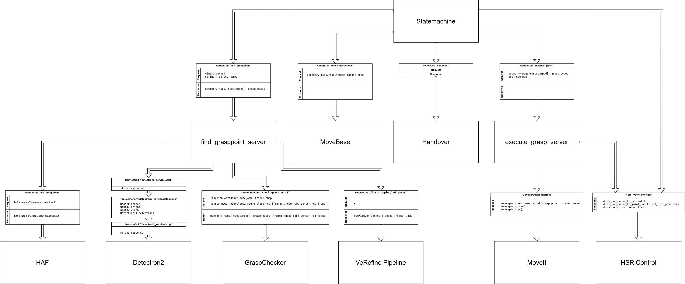

# Grasping Pipeline
Grasping pipeline for grasping YCBV objects with VeRefine and unkown objects with HAF grasping. 

## Dependencies
- [HAF](https://github.com/v4r-tuwien/haf_grasping.git)
- [object_detector_msgs](https://github.com/v4r-tuwien/object_detector_msgs)
- [sasha_handover](https://github.com/v4r-tuwien/sasha_handover)
- [open3d_ros_helper](https://github.com/SeungBack/open3d-ros-helper.git)
- [transforms3d](https://github.com/matthew-brett/transforms3d)
- [open3d](http://www.open3d.org/)
- [ros_numpy](http://wiki.ros.org/ros_numpy)
- [hsrb_moveit](https://git.hsr.io/tmc/hsrb_moveit)
- [verefine_pipeline](https://github.com/v4r-tuwien/verefine_pipeline)
- [detectron2_ros](https://github.com/v4r-tuwien/detectron2_ros)

## Usage

### Start grasping pipeline
ssh into the robot and source the workspace. 
Then, you can run the tmux bringup:
``` 
rosrun grasping_pipeline pipeline_bringup.sh
```
* start the statemachine (top right pane of tmux)
* to show commands, press s and then enter

Then you can start grasping

important commands:
* g - grasp: run the whole pipeline: find grasppoint, execute grasp, move back, handover, go back to neutral
* f - find grasp: find grasp without executing it. robot is not moving (so bring it into good position first). print result with p
* e - execute grasp: execute the grasp that was last found. need to run find grasppoint at some point first
* c - config: settings to turn on/off map usage and grasp stability check


### Grasping YCB objects 
Method 2 is for grasping one of the YCB objects on the table with verefine as pose estimator.

If you want to grasp a specific object with verefine, use Method 3 and choose the object.

Make sure the [verefine pipeline](https://github.com/v4r-tuwien/verefine_pipeline) is running and communicating with the robot. 


### Grasping non-YCB objects with haf-grasping 
Only needed if you want to grasp non-YCB objects. (Method 1)
Grasps are always top-grasps.

Make sure the [detectron docker image](https://github.com/v4r-tuwien/detectron2_ros) is running and communicating with the robot.

## Grasp Annotations
The grasp annotations are stored as numpy files in the /grasps folder. The array consists of float64 values in the shape (n, 1, 16), where n is the number of grasps stored. One grasp is represented by the 4x4 transformation matrix. The naming of the file name has to match the naming of the object. 

## Architecture
The Pipeline consists of three main parts:
- Statemachine
- Find Grasp Point Server
- Execute Grasp Server

The Statemachine is implemented with [smach](http://wiki.ros.org/smach). The Find Grasp Point Server and Execute Grasp Server are implemented as ROS ActionServers.

### Statemachine
Defines the behavior of the pipeline. Starts at the UserInput state. 

States: 
- **UserInput:** Initial smach state for the statemachine. Serves as simple user interface in the terminal. Captures input from the terimal and sets userdata. Sets outcomes depending on the input.
- **GoToNeutral:** Smach state that will move the robots joints to a predefined position, gazing at a fixed point.
- **GoBackAndNeutral:** Smach state that will move the robot either backwards (use_map is False) or to a predefined position on the map (use_map is True). Also moves the joints to the neutral position. Grasp check (turning the wrist) will be done here if enabled.
- **Opening:** Opens the robots gripper.
- **GoToTable:** Robot moves to a fixed position near the table using a move_base action goal. Also moves joints to neutral position.
- **NoGrasppointFound:** In the clear table routine, it will how often a method has been tried, and change it or go back to user input accordingly.

### Find Grasp Point Server
ActionServer that finds and selects grasp poses.

#### FindGrasppoint.action
``` 
# Goal
uint32 method
string[] object_names
---
# Result
geometry_msgs/PoseStamped[] grasp_poses
---
```
- methods
  - 1: Detectron2 & HAF
  - 2: Verefine Pipeline
  - 3: Verefine & HAF
  - 4: PyraPose


### Execute Grasp Server
ActionServer that executes the grasp. MoveIt is used to move the robot to the pre-grasp pose, the grasping and going back to a neutral position is done with the HSR python interface.

#### ExecuteGrasp.action
``` 
# Goal
geometry_msgs/PoseStamped[] grasp_poses
bool use_map
---
# Result
bool success
---
```
### Interface Diagram

[](https://viewer.diagrams.net/?tags=%7B%7D&highlight=0000ff&edit=_blank&layers=1&nav=1&title=Grasping%20Pipeline%20Interface#R7V1bc6M4Fv41qZp5iMuAje3HTnoy3VXdO72d2Z2efaEUkG2mMWIA5zK%2FfiUkAUICA%2BYWp%2FMSI4Qkzjk6%2Bs5F4sq4PTz%2FGoJg%2Fxk50LvS587zlfH%2BSteN%2BXyO%2F5GSF1qiLVcaLdmFrsPKsoJ79x%2FICtmDu6PrwEioGCPkxW4gFtrI96EdC2UgDNGTWG2LPLHXAOygVHBvA08u%2FcN14j0tXS%2FnWfkH6O72vGeNv%2FEB8MqsINoDBz3lioxfrozbEKGY%2Fjo830KPUI%2FThT53V3I3HVgI%2FVjxwH8iGP728BehiT73wANmTFLpnR27yL8FSWNXuvn3kQzgZuv6jrULQRQEyMUNpjdoN57rf6fP7%2BOYkP4d6Ui%2F27nx%2Fvgws9EBXzwuwuv4%2BORCn9whbbn%2BzgrcAOLHIS578NAD%2FncALqkBkpHgH3e471%2FTrme8XM%2B9rZESLCVEFL9wJkVP7sEDuAvjZh8fyItq%2BKe9dz3nE3hBR0KfKAb2d351E8IIi9oXTjytUPQZEAmek%2FZQ6P6D%2FBjwVnE7YczkVBdr3JMu2HMydxjDHmEYw%2BdcEXurXyE6wDh8wVX43fl8SZ9hk8fgovSUSaLBJXGfl0KTFQIm%2Fbu08bS%2Fr1gygL%2FDJMw6NAv9bWr2pxe6A14MQx%2FE8AYdfSfKiyVhf%2FauWVHCVH6Zk1218C8YLYF3ZCKABdYjjHXcR%2FxzR35%2BhX8fYRTzO7jd3E02J0%2FJUAW3Sxlt1Gb0i0i%2BU2ReVXBVoG9GTIlyyzqU40VBsWCLiGqYb4FNH%2BZK4oB8FAWkNKc36KNHPKWNRCHCeI8c3tJDyCtEcYjVxNXy5mqJW5yjhO%2BWDw5Y7Wesoz2Lo8nayFWUxnyC75hHschz4Lk7H%2F%2F24JbcIXx08YLwjhUfXMchD1OFAR6ShogkJNorYQ19F9zSMUYRFR7ScKKFv%2BCSRL8Z720sMjDMdfGpUCHtShayRW0hY3cXc2FuLyWR01YKkatSJHVFzpRE7iuMAuRHcEqTsK6u62ISrqon4ZxLYDabElmU5tYZ05IP2zpEOzzP7rDUQbx%2BHQLopFMxWcKtAN85NROnM8dkSTBrS4J6pqi087zGIthGMNYS6aCD4Si7RCHWoDvkA%2B%2BXrPQmJGssdBiBsjqfEAoYUf6CcfzCJhChl8gL%2BOzG33K%2F%2FyRNzZbs6j1HQsnFC7%2Fw8Zt9yyqSyz%2Fz97LHkiv%2BHAbBARnF1oPP7wg8r4JKETqGNsfhOi3DqmAHOcXZPCI0qmRsCD0Qu48ipC%2FFRnhc4CVXgclc1vIXipBT2LTQRIkxNwXofuqBdRHrFx9Yr5ZVD%2BAfdNA1IZYkd5tR5G4KMmQsepEhmYWGIfJ8tSnoCzpS9ljG23JprA%2BpZeNxPgrDmaKZz%2FRlTtdo09c0S2MYKVkXFMNqURASOqgGQlIijfN1Mw20qq5%2FtgLStLMFUiVoDVa0buVl07W8lCCIMi9PARlmZE39PfjGNcVN73AFYx48UzxXwIkFv5CF%2B8NIqhQO9uUriuzQDYhE3xUHRL1FbFyzgBIrkys9R3fZcSRK0NPejeF9QFH0UwgCUarImzLdZnTk4tkUptVSYYUs1GCzOdqs41jRjBbzUDV1Ts%2FNWf9rQL35u5Dn76pzfV%2FXAri%2Be%2FoQ%2Fvvu2%2B%2FfrCjU0b%2FC2%2F99vF61wWetuNLSBtCHYYuSOOvOrYCxdC18hvYxhlS7ja9pxeGc0LOLSetZvWhxja9ol6MicGGa61Oz9dfy1B9NIWvmmIwS9fHqFTCKu8FG4NTq7WEXBQNMc1rYZVSf5vzVzR81xtG65mk7t4Fpissojxl15QZQv3wbZ1UH6Lf%2BsrgaZmZPG%2F4q4seNELEEh%2B9jEMMDsPcJTG0cf%2BoXHEe5wcloeN0dGu4A%2FWobQwwfKEJaw4LfceINA67erZcEU5723ME42gwvSRkT7MNBE8Z%2BoT0nOWPKdLFcgt3byRfTF0bbfLGqpIbyfDFzXehvLWeVTCNfLCXmJBPGODm6zxhbN9ffMu30UtoFIZEG2wNRJCzvNnLIjT0eiJcMJqccsGLxd0LtwMPTO0kR6SpLJUsMe0CIvMsxgtYBBKfyZT4dbdcB%2BM4t8iPkKdJmKlPPSpBJQqXxM2O6zD5rrpxOpp8pc2q6SD9LU8EGzT9rPqfTzPEhMtAUGbTXYwqngoD1M%2Fhq523pNdaiVtQc15k7ZTzL2SgA2s5zbsaK2PwXfoXbBKrOv6SoNVshzmj5%2FLiPg0Lf%2FY5%2F7KPwmoPrAkw2K2Hy2FEbzSykvWnpxoaBLNcyAbqH4aNrQ8kk4lyjAIizjHDAyjhwhydCilcKD%2BK74rPtbCmWRO%2FAGP9DIYdPBWdG%2BJgfzCy5FsRjVSkel2lFYVtIXEc2A%2B%2B62Wg1%2BxveilqXWgJTsKJWtVk9wr4bnmLbEnBJYL0XyLWuTUE15DKGg1y8q4FRfWMZG3JbiVHLy3HGphH%2BKDGR9yHcCs%2BJa1OIF6cZsF1%2FRhcl%2FHsGYvIG0REvEeVr1HV%2BnYqI0JNndsz4%2FwMvedg437oO9G04S24URynX476CVCOB7I3mbCWeX61utyE4MGCWdB%2BUorAKL4CC1IqiaZNQjWNKIIqKqtPfFmTUN9DH3xdk6BLxfhiYIh%2BFHJShUiB6NzCTEMftHtrfs1TA0S3L1kFT6qq16etIUVOjepP%2F6NaoVtjBMxlr9MsLnto%2BWcuPPguGnbBJExawxE5snP70c2%2BW6HniYXxKfWuplFRnml6oUTo3Thulpkr0Lv4oCKPWiQaYl%2BAQ1cQlHe5Cr79NvxxVKPnaib0g78ynmuPN2QflloGFnMMJ46B2LDAXCIygH2XvlKTZ3Xro6CSSiI19aNnk0gqR0jTZQ4Dv7R4cizWEf1u0ykXHHdPJ3l3ccWkqZlcXcUdDPuXhK4yPoT8pfaPQ6%2F3pmxP%2Bw0mee9Fy8r22UzKM%2Bp4tfrjbRphZioVLObU6MYd%2F5A%2BWmsOMj8LemaE2z%2FRuDn94dzcZK9gBj66zdSOSArxLYMgebC11oHVRnY84tmm7nqhh25ncvE9AZIh8fTLiI1jJTjo%2BivgE2dEmLTvLsYVHPhxQV8CMwnKxw2QL6r99er4oW2SvxAxjmSpm4ejG9bqu%2FbxsTpSy6fM7Clz7k4uNJJ%2FoJ8EnlBe5iGYzpIUYhgupCe1kusR%2Bi0MIM%2BcPtdzep91Si00Q%2Fws4%2BjOVyNqwfFVTXLSqOXQJ7p2F6qjP3uynRW9nd3aRib0od3X1nonNO8JmlZ8NKU2cvtWEluWBsNS4dp1%2FwBZXosH27Ee6%2BNLhnIrKlg3a6HPQ6cGnTAy6GvRikEFTee5qzGafYx7X65iuXWpnY3q7MgdBWHebkXw6jj4CLu%2FAwfWIasxcMEo9e%2B7xtdeKJDnlAbbFU%2FbOgFPlSZ9qMBXFqINtcbVgFE3lJB3KWZyL6iTfCwVQWl1Ec%2BnxsYXqsOH%2BAFT903YbAqgu%2FIYL2QE96q6XJhqzsX92IRO2r2TMhZzcOikZU5CiNxnj7Y4Z5GBH6hOHLk%2BJfbWBiVS2zhF8rS%2FJX1afW%2BqjosC3DQiUqop6kQK%2BgOZDBRyE5UMFi9EOD1rKKmOSlFTEXLiICoTs%2FMSe3tEq1sQDw1Xco4xXlxfg8GvsRZf8xQon%2BpuEr8tB%2FX%2FL3vx%2FnSw2sv%2FvtcDXZWuDfwD4ulTlwU1IxgaFrxP4Ns0lwddlfWNlDPhafTjjlEEXJ6wAusZOdOnx44qn0k0k93R6WhYejp3sI0nSTKN7eoKz6tgs%2BtmCNwa9tAL0Gnq%2F93Sxl3nClTHufu9lfcfACPu9zfK9uEGLwNV5qoBGqhId8NEPjrE6VFVoJKteErRidcUKwRSW4S5TztNJ0DZUpck55%2Bn3l%2FJSV%2FzUTyup0yWpG2BXfPOZOOSueFM%2B%2F%2Bs8RDvkdP3tGDear7R%2B1YQVa5zewT4lMJ2Kd5dnghk9YWtzUYmtL%2FE4es4fAZPPR8bk4mQ%2FP%2BX3%2FCR24Duo6tMuZ55pfQDh92PkxT7RJRHAImXt0y7zcJ8C0clmFkvHVg%2F90ZaGVl5G5BbmXSXTym07LktKc868gMyPFlJT%2BEZB7VOQ25lzr%2BcQZPOEa29cc84sc5SR3HvPA0EEnUr%2Bd%2BiQV3D7zHTfs5grc7J8I%2BVgicD5wyG2HgI0bXSLMBiwYgyPo3z2qOrAoB%2BHMJ9rmbZOCSq3TDXVls1OLFM5RWgAy7QrpdJFBKZcqbQ%2B%2BblbrcJbn0p4UcHO1rlAw58JvWrzReNXbv4p8mC4s3t08%2B9ss%2B0zxtkf49KVpjbSD1F0jddX36dumwNu1qUf885kR8%2FRaHqGmfQ1zclsGOY8mqdHYn0k62uCMSo5lGfKjLHLRSl7rBirptAFHsllcpDNbljJNlIrSDqz3KyrqrtpW7OESyLj32Luk25s9FkhBqc4STb9uo0Qg9NaGW2v58zllSr%2FSTLa7tjBb8OfcLXqImNKydoWO3dk6vW%2BY5LpmTITRXHyK9sjJ%2FcsNKNYqBJFf80SJ8hS5aNE3UudZ8rnxG6y0qEEXQ1l1nYEnREjYufbWwyVjE2Rn0anSHa80ejE%2BPlKcb4ScghOqhxZUb1V7z5dr4Xxttp%2B%2BmOeT3yeE%2FQ2OhmSg1SbC24T6elsrJn0zHao5cDLK0%2FE36YALM0zkQsfoVFAxY0CKnaRu7Bq8%2FH5Zk6Elg6BNs6HWk4Ezp%2B8E4Haw106Edijhe9b62bRsJ0XHfl0qOy5JmC%2Fy%2FB0N7FppYfjBrRKtxbt6tSsfnK%2FuzNsW89QyH0d1gPgLt%2Fq78ZP%2FNtUi0KYcSrB6QnJ04f7r1dJGCcOyVc4O8t2cJAdzfZRSD005ONaDnyEHgqsA%2FCPwLOSnWgKr0yxSOGBUcti9Yew2sqilkaEboD9fZc0c4s8FCbNGtvkL9G8DtPj7xM84NrdyLC%2B3hTU3VT8eCUZFjn9keiSvMi19b%2F64NHdAdJd4StpuJ6W11n8dpp7wdWlMvdCKUfr6qP8LtO9py2KGRK1E%2Bwv%2FbPUaiHRS31WE0jTqJDrqR6bph5yeVbwYCkURTPp7HP387ZY1UHXHF0LTiCSTXFXbFGZYlFi8snxsNefY1E9Q1snXijC0GuF9Lc4C7Sm9MtRhQGyMTrSHYN%2BKFs95oltxK5L6nNPXRswfUL9Av27Q6aWU1HJyLyPpMKI7tJx0jD7gpqATaPxrQ08EB6keHtdI2%2F9Fr92rK9XrWPvVQHai0Xn%2FKVzqj8XfB946ezii8dK1va2cm56h90nAnX1AlH0mac98rDtj5yXWeIFiJHlw2McAi8Ll2QAWVH7L7JwE5CdIM3op8J1ZSOdxLK6DM7RZ%2BgrEGVs45eAr%2Fm82pqzLJ3xjQNGeY2mgvf9zTL9B07Ks%2B40TloNhJMSvyKK88tUCIL9Z6zjSI3%2FAw%3D%3D)
