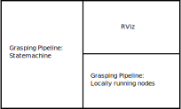

Starting the grasping pipeline
==============================

This page will tell you how to start the grasping pipeline. It will also explain how to use the tmux session that is created when starting the grasping pipeline. It will also explain how to start the grasping-pipeline rviz visualization and which visualization topics exist.

******************************
Starting the grasping pipeline
******************************
If you set up the grasping pipeline according to the installation instructions, you shoult be able to start the grasping pipeline by running the following command in the terminal:

.. code-block:: console

    $ gp

.. note:: 
   If you are using the Docker container make sure to start the container first:

   .. code-block:: console

       user@host         $ hsr
       root@CONTAINER_ID $ gp 

This should open up a tmux session.

===================
Tmux session layout
===================
When starting the grasping pipeline, a tmux session is created. The tmux session is divided into two windows and multiple panes. 

The first window you will see is the window for the grasping pipeline. It is divided into three panes. 
The first pane is for the grasping pipeline nodes that are running locally, the second pane is for the rviz visualization and the third pane is for the grasping pipeline nodes running on sasha.

.. note::
    Generally, most nodes are running locally because the development computer is much more powerful than sasha. 
    However, some nodes are running on sasha to reduce the network load because they subscribe to topics that require a high bandwith (e.g. pointclouds or rgb/depth images). 

None of the panes are running when the tmux session is started. You can start them by navigating to the corresponding window and pressing enter.
You should start the nodes in the following order:
1. Start the pose estimator and wait until it is running.
2. Start both the local and sasha grasping pipeline nodes.
3. Open rviz if needed.

Additionally, there is a second window in the tmux session. This window only has one pane which is used to automatically start MoveIt. MoveIt is also running on sasha because of the high bandwith requirements.

You can swap between the windows by pressing `Ctrl+b` and then `n`.

The grasping pipeline succesfully started if you see the following output in the tmux session:

.. image:: images/tmux_succesful_start.png
    :width: 80%
    :align: center

You should see the user input prompt in the left pane and the message "Initializing FindGrasppointServer done" in the lower right pane.

The MoveIt window should show the message "You can start planning now!":

.. image:: images/tmux_moveit.png
    :width: 80%
    :align: center

Note that MoveIt prints warnings very often (Thanks Toyota!). This means that you might have to scroll up quite a bit to see the "You can start planning now!" message.

==================
Rviz visualization
==================
This section will explain how to start the grasping-pipeline rviz visualization.
All grasping-pipeline related visualization topics will be listed and explained.

Start the grasping-pipeline rviz visualization by running the following command in the terminal:

.. code-block:: console

    $ rv

This should open up the following rviz window that is customized for using the grasping-pipeline, if you used the provided rviz configuration file.

The following visualization topics are turned on by default:

* **Grid**: A grid that helps to estimate the size of objects in the scene.
* **Static Map**: The prerecorded map of the environment. All waypoints that the grasping pipeline uses are relative to this map.
* **Dynamic Map**: The map that is created by the robot while exploring the environment. It is used to prevent the robot from colliding with obstacles during navigation.
* **Robot Model**: The robot model that is used for visualization. By default the collision model is used to visualize the robot.
* **MoveIt Trajectory**: The trajectory that MoveIt is planning for the robot. It is only shortly shown when the robot succesfully planned a motion.
* **Laser Scanner**: The laser scanner data that is used for obstacle avoidance.
* **TF**: Visualize the coordinate frames of the robot and the objects in the scene. The visualization of most frames is turned off by default. 
* **Placement Debug BB**: The (enlarged) bounding box of the plane that the robot will place the object on.
* **Placement Debug Waypoints**: The waypoints that the robot uses to place objects on the table.
* **Grasp BB and Grasp Marker**: The bounding box of the object that the robot is trying to grasp and a grasp marker that shows the grasp pose.
* **Xtion Point Cloud**: The point cloud of the RGBD-camera that is mounted on the head of the robot.
* **Pose Estimation Result image**: 2D image of the pose estimation result. It shows the detected object and the estimated pose of the object (projected onto the image).

The following topics are turned off by default:

* **MoveIt Motion Planning:** Provides options to change the used planner, change the collision environment, and many more.
* **MoveIt Planning Scene:** Visualizes the environment that is used for motion planning. It shows the robot, some manually added collision objects (e.g. the table), and an octomap that is created from the point cloud and laser data.
* **Raw Image:** The raw RGB image of the RGBD-camera that is mounted on the head of the robot.

This is only a short overview of the most commonly used visualization topics. There are more visualization topics available. You can see a list of all available topics by clicking on the "Add" button in the "Displays" panel.

Some images of the visualization topics are shown below:

    This image shows the static map, the dynamic map, the robot model, and the laser scanner data.

.. figure:: images/planning_scene.png

    This image shows the MoveIt planning scene. The robot, the collision object for the table (green bounding box), and the octomap are visible.

.. figure:: images/after_find_grasp.png

    This image shows the bounding box of the object that the robot is trying to grasp (blue) and the grasp marker (red arrow). Additionally, the pose estimation result image is shown.

    This image shows the bounding box of the table that the robot will place the object on (green) and the waypoints that the robot uses to place the object on the table (white marker). 
    Additionally, the bounding box of the object is shown (green). The translation of the object is most likely wrong. It should only be used to see the orientation of the object after the placement.